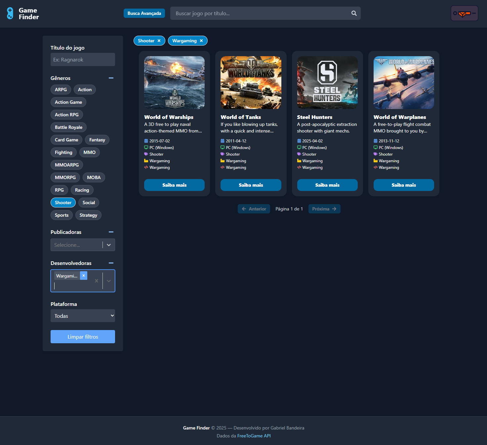

# 🎮 Game Finder

Uma plataforma web para encontrar jogos gratuitos com base em filtros como gênero, plataforma e memória RAM disponível. Construída com **React + Vite**, com foco em **acessibilidade**, **tema escuro/claro**, **busca inteligente** e integração com a [FreeToGame API](https://www.freetogame.com/api-doc).



---

## ✨ Funcionalidades

- 🔍 Busca inteligente com sugestões em tempo real
- 🎨 Tema claro/escuro com suporte a acessibilidade
- 🧠 Filtros dinâmicos com visualização e remoção de filtros ativos
- 🎭 Efeitos animados com Framer Motion
- 🧮 Filtro por memória RAM mínima para recomendações compatíveis
- 🖼️ Carrossel com capturas de tela detalhadas do jogo
- 📱 Responsivo (desktop e mobile)

---

## 📸 Projeto em Produção (Vercel)

https://game-finder-two.vercel.app/

---

## 🚀 Tecnologias

| Ferramenta                                                | Descrição                                |
| --------------------------------------------------------- | ---------------------------------------- |
| [React](https://reactjs.org)                              | Biblioteca para interfaces web           |
| [Vite](https://vitejs.dev)                                | Bundler moderno e rápido                 |
| [TailwindCSS](https://tailwindcss.com)                    | Utilitários CSS altamente customizáveis  |
| [Framer Motion](https://www.framer.com/motion/)           | Animações fluídas e acessíveis           |
| [React Icons](https://react-icons.github.io/react-icons/) | Ícones SVG populares                     |
| [SwiperJS](https://swiperjs.com/)                         | Carrossel com touch e navegação          |
| [FreeToGame API](https://www.freetogame.com/api-doc)      | API pública com milhares de jogos grátis |

---

## ⚙️ Instalação

```bash
# Clone o repositório
git clone https://github.com/seu-usuario/game-finder.git
cd game-finder

# Instale as dependências
npm install

# Rode o projeto localmente
npm run dev
```

## 🧪 Estrutura do Projeto

```plaintext
├── api/                   # APIs para Games e Game Details
├── src/
│   ├── assets/            # SVGs e imagens
│   ├── components/        # Componentes reutilizáveis
│   ├── hooks/             # Hooks customizados
│   ├── pages/             # Páginas principais (Home, Detalhes, Busca)
│   ├── utils/             # Utilitários auxiliares
│   ├── App.jsx            # Root do app
├── public/                # Assets públicos
├── vite.config.js         # Configurações do Vite (inclui proxy)
└── README.md              # Este arquivo
```

## 🔐 Hospedagem e Proxy

- Em produção (ex: Vercel), o projeto consome diretamente a FreeToGame API.

- Durante o desenvolvimento, é possível usar um proxy local via vite.config.js ou criar handlers em /api para facilitar o uso com o mesmo domínio.
  export default defineConfig({

```plaintext
// vite.config.js
export default defineConfig({
	plugins: [react()],
	server: {
		proxy: {
			'/api/games': {
				target: 'https://www.freetogame.com',
				changeOrigin: true,
				secure: false,
				rewrite: (path) => path.replace(/^\/api\/games/, '/api/games'),
			},
			'/api/game': {
				target: 'https://www.freetogame.com',
				changeOrigin: true,
				secure: false,
				rewrite: (path) => path.replace(/^\/api\/game/, '/api/game'),
			},
		},
	},
});

```

## 📌 Melhorias futuras

- Suporte multilíngue (i18n)
- Testes Automatizados
- Sistema de Avaliação
